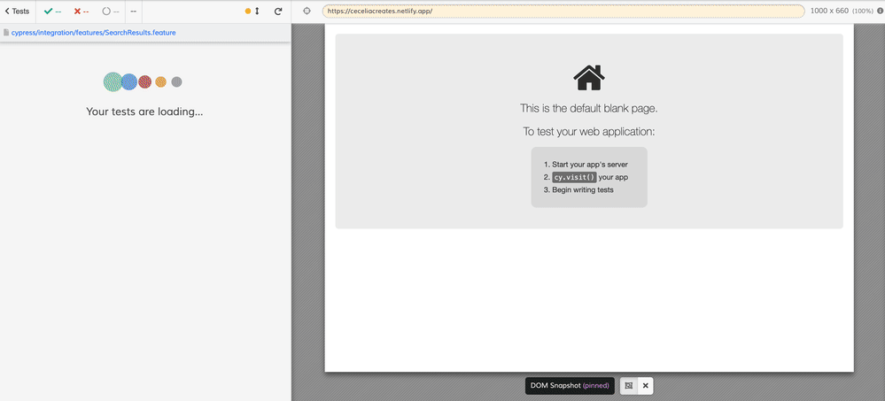

# Cypress Cucumber Tutorial

Learning Cucumber and BDD concepts with Cypress and the [cypress-cucumber-preprocessor](https://github.com/TheBrainFamily/cypress-cucumber-preprocessor) plugin.

## About (Work in Progress)

This repo is a learning ground for a few things:

- Behavior Driven Development Concepts
- Cucumber - a framework for writing and running BDD-style tests with Feature Files and Step Definitions
- Gherkin - a syntax for writing BDD features (Feature, Background, Example/Scenario, Given/When/Then, etc.)
- Using Cypress plugins
- Designing a test suite

## Resources

Shout-out to the following free tutorials I leveraged:

- [Test Automation University - Cucumber with Javascript](https://testautomationu.applitools.com/cucumber-javascript-tutorial/)
- [QA Camp - Cypress - Cucumber (YouTube)](https://www.youtube.com/watch?v=qupyblTFqd8)

I'd also recommend checking out:

- [Cucumber Documentation](https://cucumber.io/docs/cucumber/)
- [The very comprehensive README for the cypress-cucumber-preprocessor plugin](https://github.com/TheBrainFamily/cypress-cucumber-preprocessor)

## Example test run

